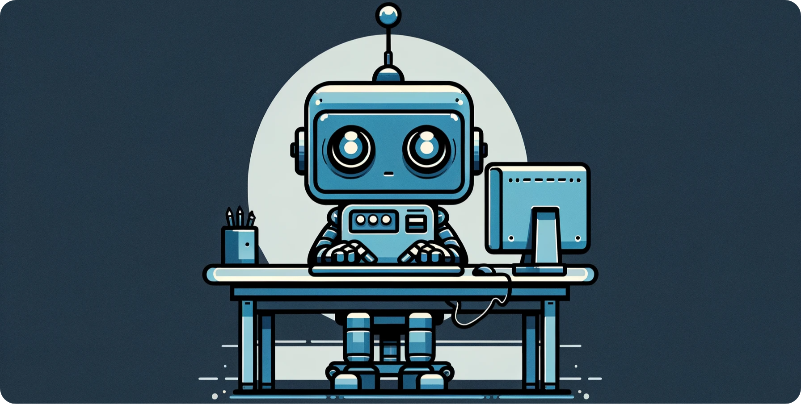
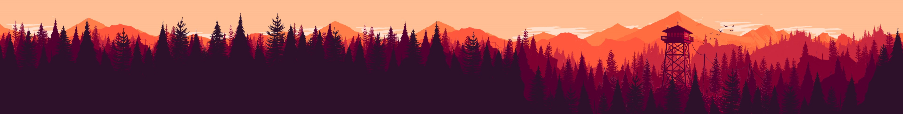

<head>
    
</head>
<body>

<h1 align="center">HELLO, I'm Shivaansh</h1>
<ul>
    <li>💻I’m a student at University of Alberta, pursuing Bachelors degree in Computer Science  </li>
    <li>🦾I'm looking forward to learning more about AI/ML and Deep Learning</li>
    <li>✉️You can reach me via email by clicking <a href="mailto:shivaanshbhatia007@gmail.com">here</a></li>
</ul>

<h3>Languages</h3>
<table>
    <tr>
        <td>
             
        </td>
        <td>
            <code>🟢🟢🟢🟢🟢🟢🟢🟢⚫⚫</code>
        </td>
        <td>
            
        </td>
        <td>
            <code>🟢🟢🟢🟢🟢🟢🟢🟢⚫⚫</code>
        </td>
        <td rowspan="4"></td>
    </tr>
    <tr>
        <td>
            
        </td>
        <td>
            <code>🟢🟢🟢🟢🟢⚫⚫⚫⚫⚫</code>
        </td>
         <td>
            
        </td>
        <td>
            <code>🟢🟢🟢🟢🟢🟢⚫⚫⚫⚫</code>
        </td>
    </tr>
    <tr>
        <td>
            
        </td>
        <td>
            <code>🟢🟢🟢⚫⚫⚫⚫⚫⚫⚫</code>
        </td>
        <td>
            
        </td>
        <td>
            <code>🟢🟢🟢🟢⚫⚫⚫⚫⚫⚫</code>
        </td>
    </tr>
    <tr>
        <td>
            
        </td>
        <td>
            <code>🟢🟢🟢🟢🟢🟢⚫⚫⚫⚫</code>
        </td>
    </tr>
    
</table>

<h3>Tools</h3>
<table>
    <tr>
        <td>
            <h3>Web Dev Tools</h3>
        </td>
        <td>
            
            
            
            
        </td>
    </tr>
    <tr>
        <td>
            <h3>Familiar Coding Environments</h3>
        </td>
        <td>
            
            
            
            
            
        </td>
    </tr>
    <tr>
        <td>
            <h3>AI/ML Libraries</h3>
        </td>
        <td>
            
        </td>
    </tr>
    <tr>
        <td>
            <h3>Databases</h3>
        </td>
        <td>
            
            
        </td>
    </tr>
    <tr>
        <td>
            <h3>Graphics and Visuals</h3>
        </td>
        <td>
            
            
            
            
            
            
            
            
        </td>
    </tr>
    <tr>
        <td>
            <h3>Miscellaneous</h3>
        </td>
        <td>
            
            
            
        </td>
    </tr>
</table>

<h3>Hobbies</h3>
<table>
    <tr>
        <td>
           <h4>Photography📷</h4>
            <ul>
                <li>I've been doing photography and capturing life since 2018 now and switched to a professional camera gear two years ago.</li>
                <li>What do I like capturing? Everything, but sunset and northern lights top it all. </li>
                <li>Check out my photography page by clicking <a href="https://www.instagram.com/clicks_happen/">here</a>.</li>
            </ul> 
        </td>
        <td>
            
        </td>
    </tr>
    <tr>
        <td>
            
        </td>
        <td>
            <h4>Digital Art</h4>
            <ul>
                <li>Taking on digital art was more of challenge to myself than exploring.</li>
                <li>I was more of a traditional paper and pencil artist, but with the surge of technology around 2017 forced me to discover this field, and then there was no turning back.</li>
                <li>From drawing for fun to posting them on <a href="https://opensea.io/Wr4th">opensea.io</a> as NFT was a journey in itself.</li>
                <li>Also, do checkout my latest digital art timelapse by clicking <a href="https://www.youtube.com/watch?v=6yXTphWZny4&feature=youtu.be">here</a>.</li>
            </ul>
        </td>
    </tr>
</table>

</body>

